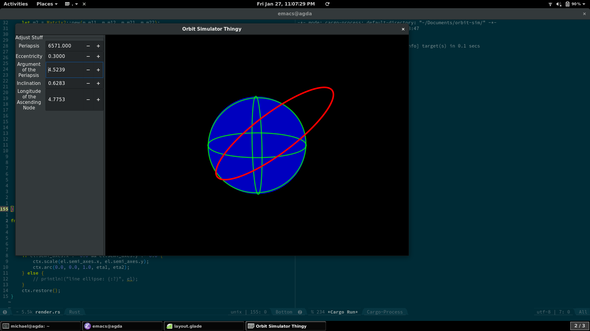

# Week 3

I added a model for all elliptical orbits and added rendering for them.
This also meant that changing the camera's longitude now has an actual effect, so I made that work too.
Semi-transparent rendering of things inside/behind the planet is broken at the moment, though.

